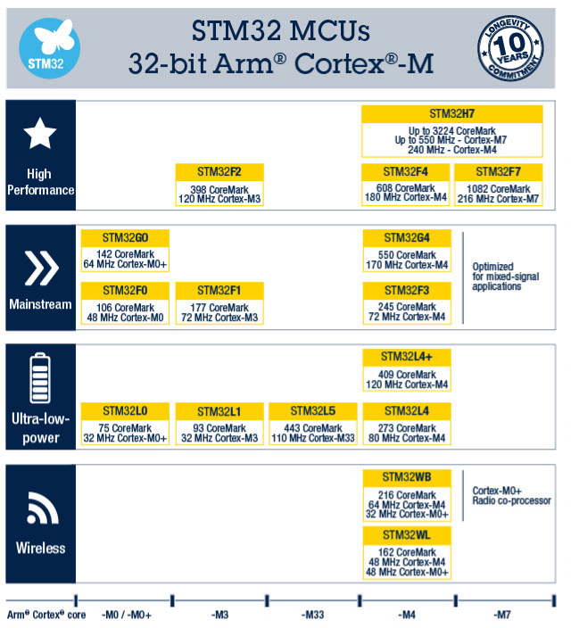
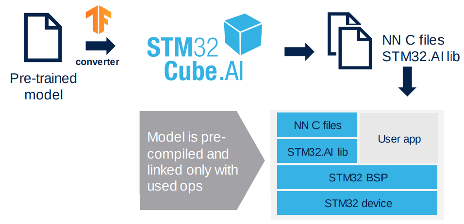
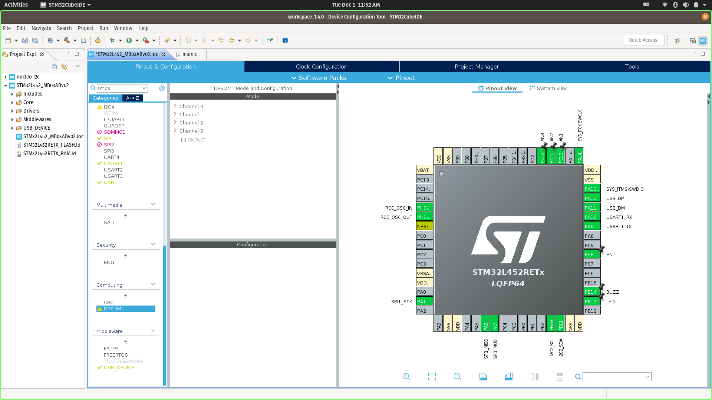
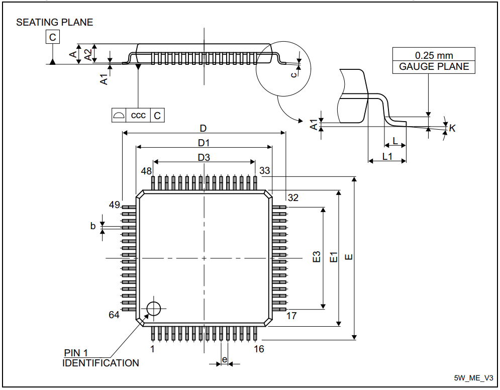

### Intelligent Solar Charge Controller MCU Suggestion
<!-- @import "[TOC]" {cmd="toc" depthFrom=1 depthTo=6 orderedList=false} -->

<!-- code_chunk_output -->

- [Intelligent Solar Charge Controller MCU Suggestion](#intelligent-solar-charge-controller-mcu-suggestion)
  - [STM32L476RGT6](#stm32l476rgt6)
    - [Why choose an STM32 32-bit ARM Cortex MCU?](#why-choose-an-stm32-32-bit-arm-cortex-mcu)
    - [Why STM32L476RGT6 out of other STM32 MCU?](#why-stm32l476rgt6httpswwwstcomresourceendatasheetstm32l476rgpdf-out-of-other-stm32-mcu)
  - [Prices](#prices)
  - [Future Develepment Thoughts](#future-develepment-thoughts)
    
<!-- /code_chunk_output -->
#### STM32L476RGT6
The STM32L476RGT6 device is an ultra-low-power microcontrollers based on the highperformance Arm® Cortex®-M4 32-bit RISC core operating at a frequency of up to 80 MHz. The Cortex-M4 core features a Floating point unit (FPU) single precision which supports all Arm® single-precision data-processing instructions and data types. It also implements a full set of DSP instructions and a memory protection unit (MPU) which enhances application security.
<figure>

<figcaption>Actual photo of STM32L476RGT6</figcaption>
</figure>
The STM32L476xx devices embed high-speed memories (Flash memory up to 1 Mbyte, up to 128 Kbyte of SRAM), a Quad SPI flash memories interface and an extensive range of enhanced I/Os and peripherals connected to two APB buses, two AHB buses and a 32-bit multi-AHB bus matrix.

The devices offers: 
- up to three fast 12-bit ADCs (5 Msps)
- two comparators 
- two operational amplifiers
- two DAC channels, 
- internal voltage reference buffer 
- low-power RTC 
- two general-purpose 32-bit timer 
- two 16-bit PWM timers dedicated to motor control 
- seven general-purpose 16-bit timers 
- two 16-bit low-power timers

In addition, up to 24 capacitive sensing channels are available. The devices also embed an integrated LCD driver 8x40 or 4x44, with internal step-up converter.

##### Why choose an STM32 32-bit ARM Cortex MCU?

- Wide range of STM32 microcontrollers, based on an industry-standard core, comes with a vast choice of tools and software to support project development, making this family of products ideal for both small projects and end-to-end platforms.

- Provides new set of Artificial Inteligence _(AI)_ Solution form ST, in which pre-trained Artificial Neural Network can be mapped and run STM32 MCUs.

- MCU peripherals can be easy configured and programmed using ST's free _STM32CubeIDE_ development tool. It is an advanced C/C++ development platform with:
   - peripheral configuration 
   - code generation 
   - code compilation 
   - and debug features for STM32 microcontrollers and microprocessors

<figure>

<figcaption>STM32CUBEIDE Pinout and Configuration</figcaption>
</figure>

##### Why [STM32L476RGT6](https://www.st.com/resource/en/datasheet/stm32l476rg.pdf) out of other STM32 MCU?

1. ***STM32*** _(STM32 Family)_	
   STM32 is a 32-bit family of MCU based on ARM Cortex -M Processor. It is a group of 32-bit RISC processor cores that are optimized for low-cost and energy-efficient microcontrollers.

2. STM32**x** _(Type)_
   ST’s ultra-low-power MCU platform is based on a proprietary ultra-low-leakage technology and optimized design.

   | Type |                                         |
   | :--: | :-------------------------------------- |
   | F | Foundation; Sometimes: High-Performance |
   | G | Mainstream                              |
   | L | Low-Power                               |
   | H | High-Performance                        |
   | W | Wireless                                |

   The ultra-low-power MCU type offers:
   - 300 nA in VBAT mode: supply for RTC and 32x32-bit backup registers
   - 30 nA Shutdown mode (5 wakeup pins)
   - 120 nA Standby mode (5 wakeup pins)
   - 420 nA Standby mode with RTC

   
3.  STM32L**x** _(Core)_
   Conceptually the Cortex-M4 is a Cortex-M3 plus **DSP** instructions, and optional floating-point unit **(FPU)**. STM32L4 series also offers more memory.

      |  Core |     |
      | :--: |:----------------------- |
      | 0 | Arm Cortex M0|
      | 1 |Arm Cortex M3|
      | 2 |Arm Cortex M3|
      | 3 |Arm Cortex M4|
      | 4 |Arm Cortex M4|
      | 7 |Arm Cortex M7|

   - With DSP, you  can measure, filter or compress continuous real-world analog signals (e.g. ADC). Also, dedicated DSPs usually have better power efficiency. We can use this on sensing various analog signal from iSSC such as battery voltage levels and MEMS (if we want to add this feature).
   - FPU is designed to carry out operations on floating-point numbers

4. STM32L4**x** _(Memory Line)_
   STM32L4 Series are offered in different memory sizes. 

   | Code | Flash (kB) | RAM (kB) |
   | ---- | ---------- | -------- |
   | 1 | 64 to 128   | 40 |
   | 3 | 128 to 256  | 64  |
   | 5 | 256 to 512  | 160 |
   | 7 | 256 to 1024 | 128 |
   | 9 | 512 to 1024 | 320 |
   
   The memory line 7, which ha a maximum flash memory of 1024 KByte is typically sufficient enough to run most applications with Artificial Neural Network and FreeRTOS.

5. STM32L47**x** _(Line)_

   | Code | Line                               |
   | ---- | ---------------------------------- |
   | 1    | Access Line                        |
   | 2    | USB Device Line                    |
   | 3    | USB Device Line + Segment LCD Line |
   | 5    | USB OTG Line                       |
   | 6    | USB OTG Line + Segment LCD Line    |
   
   Basically we would only want to use the USB OTG Line, but it would not hurt to include a Segment LCD Line for future purposes.

6. STM32L476**x** _(No. of Pins)_
   The there are wide selection of pin numbers, but the 64pins are the lowest under the _STM32L476xx_ subfamily. 

   | Code | Number of Pins|
   | ---- | ---------------------------------- |
   |R|64|
   |J|72|
   |M|81|
   |V|100|
   |Q|132|
   |Z|144|

<figure>

<figcaption>LQFP - 64 pins, 10 x 10 mm low-profile quad flat package outline</figcaption>
</figure>

7. STM32L476R**x** _(Flash-Memory Size)_
Memory size can be a contributing factor on future updates on the firmware. The higher the Flash-memory size, the better, if price is not a big factor. Therefore its better to get the variant with the highest available flash-memory.

   | Code | Flash-memory Size|
   | ---- | ---------------------------------- |
   |C|256 KByte|
   |E|512 KByte|
   |G|1024 KByte|

8. STM32L476RG**x** _(Package)_

   |Code | Flash-memory Size|
   | :--- | ---------------------------------- |
   |T|LQFP ECOPACK®2|
   |I|UFBGA (7 × 7 mm) ECOPACK®2|
   |J|UFBGA (10 × 10 mm) ECOPACK®2|
   |Y|CSP ECOPACK®2|

9. STM32L476RGT**x** _(Temperature Range)_
   The climate in the Philippines are not that extreme so a temperature range of -40°C and 85°C is sufficient enough to serve its purpose. 
   |Code | Temperature range|
   | ---- | ---------------------------------- |
   |6|-40°C and 85°C|
   |7|-40°C and 105°C|
   |3|-40°C and 125°C|
10. STM32L476RGT6**x** _(Option)_

   |Code | Description|
   | ---- | ---------------------------------- |
   |Blank|Standard production with integrated LDO|
   |P|Dedicated pinout supporting external SMPS|

   We do not need dedicated SMPS since we are using VBAT mode. so the better choice is leave the option blank.

#### Prices
Below are the prices of STM32L476RGT6 offered on the market taken last Feb 11, 2021. Prices may vary everyday but the given figures shows more or less the price range.
   |Link | Price / Unit|
   | ---- | ---------------------------------- |
   |[LSCS Electronics](https://lcsc.com/product-detail/ST-Microelectronics_STMicroelectronics_STM32L476RGT6_STM32L476RGT6_C74797.html/?href=jlc-SMT)|US$ 9.53|
   |[Digikey.ph](https://www.digikey.ph/product-detail/en/stmicroelectronics/STM32L476RGT6TR/497-19382-1-ND/10063407)|US$ 11.19|
   |[Mouser.com](https://www.mouser.com/ProductDetail/STMicroelectronics/STM32L476RGT6TR/?qs=%2Fha2pyFaduh7r4VizUg26La3%252Bme86r1pEBUkKtOFAf3LugsE%252BgElig==)|US$ 9.94|

   Note: Some online PCB fabrication services though offers the MCU on much less if you order on thier platform such as JLCPCB.
##### External References
- [STM32 32-bit Arm Cortex MCUs](https://www.st.com/en/microcontrollers-microprocessors/stm32-32-bit-arm-cortex-mcus.html)
- [STM32 Ultra Low Power MCUs](https://www.st.com/content/st_com/en/products/microcontrollers-microprocessors/stm32-32-bit-arm-cortex-mcus/stm32-ultra-low-power-mcus.html)
- [STM32CubeIDE Integrated Development Environment for STM32](https://www.st.com/content/st_com/en/products/development-tools/software-development-tools/stm32-software-development-tools/stm32-ides/stm32cubeide.html)
- [STM32 solutions for Artificial Neural Networks](https://www.st.com/content/st_com/en/stm32-ann.html)
- [STM32L476xx Datasheet](https://www.st.com/resource/en/datasheet/stm32l476rg.pdf)
- [JLCPCB.com](https://jlcpcb.com/)

Rev.02
